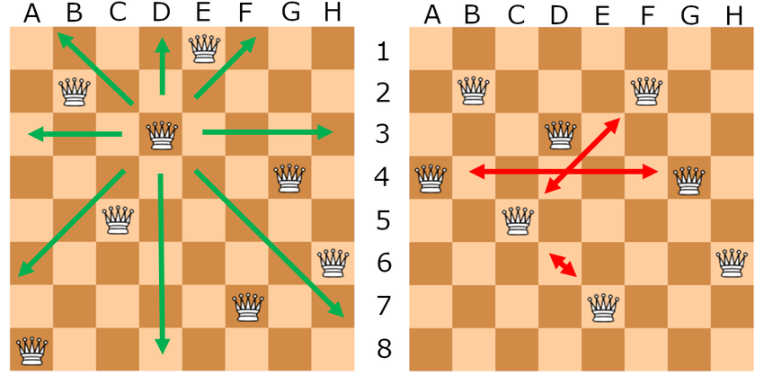

# Backtracking Algorithm for 8-Queens Problem

## Define Backtracking Algorithm

Backtracking is an algorithmic-technique for solving problems by trying to build a solution incrementally. It removes solutions that fail to satisfy the constraints of the problem at any point in time. For the 8-Queens problem, backtracking is used to systematically explore all possible configurations of queens on an 8×8 chessboard, ensuring that no two queens threaten each other.

## Define the Problem of 8-Queens

The problem involves placing 8 queens on an 8×8 chessboard so that no two queens threaten each other.

## Explain The Algorithm Steps

### Initialization

- Initialize an empty chessboard.

### Recursive Backtracking

1. **Base Case:** If all queens are placed (`col == N`), print the board and return `True`.
2. **Loop Through Rows:** For each row, check if it's safe to place a queen in the current column.
3. **Place Queen:** If safe, place the queen and recursively try to place queens in subsequent columns.
4. **Backtrack:** If placing a queen in the current position doesn't lead to a solution, backtrack by removing the queen and trying the next row.

## Explain Code Structure

### `solveNQueens` Function

- **Input Parameters:**
  - `board`: The chessboard represented as a 2D array.
  - `col`: The current column being processed.
- **Output:**
  - Returns `True` if a solution is found, otherwise `False`.

### `isSafe` Function

- **Input Parameters:**
  - `board`: The chessboard represented as a 2D array.
  - `row`: The current row.
  - `col`: The current column.
- **Output:**
  - Returns `True` if it's safe to place a queen in the current position, otherwise `False`.
### Prerequisites

- Ensure you have Python installed on your computer. If not, download and install Python from the [official website](https://www.python.org/).

### Steps to Run the Code

1. **Download the Code:**
   - Copy the provided Python code containing the `solveNQueens` and `isSafe` functions into a Python script file (e.g., `queens.py`). Save it to your computer.

2. **Open a Text Editor:**
   - Use any text editor (e.g., Notepad, VS Code, Sublime Text) to open the downloaded Python script (`queens.py`).

3. **Edit the Code:**
   - Locate the code where the chessboard size (`N`) is defined. By default, it's set to `N = 8`, but you can modify it to any desired size.
   - Optionally, you can customize the output or any other parameters based on your requirements.

4. **Run the Script:**
   - Open a terminal or command prompt.
   - Navigate to the directory where the Python script is located.
   - Execute the Python script by typing `python queens.py` and pressing Enter.
   
If the script finds a solution, it will print the configuration of the chessboard with queens placed in safe positions. If no solution is found, it will print "No solution found".

## Conclusion

This backtracking algorithm provides a method to solve the 8-Queens problem by systematically exploring all possible configurations of queens on the chessboard. It demonstrates the use of recursion and backtracking to find a valid solution that satisfies the constraints of the problem.

